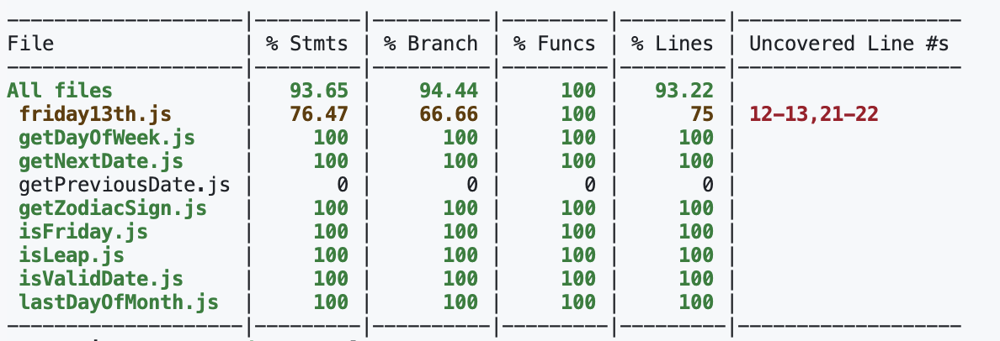
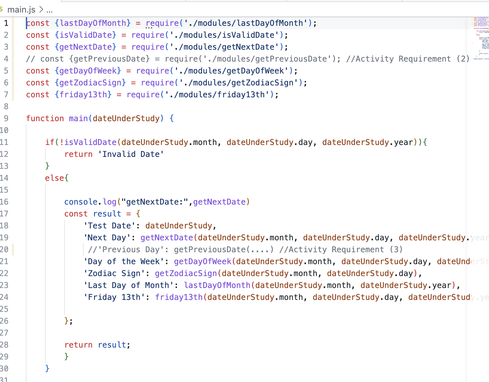
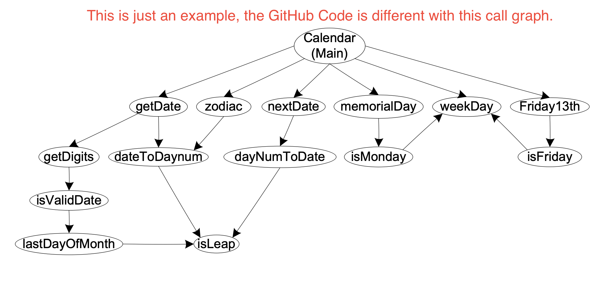

# Integration Testing of Calendar Application

## Introduction

This is an integration testing of the calendar application. The program is developed in JavaScript.

It has the following modules.


## Runner

``` node runner.js ``` Allows you to run and modify the inputs in the program.

## The Unit test cases

The unit test cases are written in JEST and are located in the __tests__ folder.

## Stub and Driver functions

In Jest the **stub functions** are called **Mock functions** and are defined with the following syntax.

```javascript

jest.mock(moduleName, factoryFunction, options); 

```

For example, the following stub function is used to mock the `lastDayOfMonth` function.

### Automatic Mocking

If you call `jest.mock(moduleName)` without a factory function, Jest will automatically mock the module.

```jest.mock('./modules/lastDayOfMonth');```

### Manual Mocking

```javascript

jest.mock('./modules/lastDayOfMonth', () => ({
    lastDayOfMonth: jest.fn(() => 30)
  }));

```

This means that you can mock the lastDayOfMonth function in the test file, and it will always return 30.

### How to use Jest's Mock functions in Integration Test

In the integration test, you can use the Mock functions. For example, you can use the lastDayOfMonth function in the test file.

### How to use Jest's Mock functions in Unit Test

In the unit test, you can use the Mock functions. For example, you can use the lastDayOfMonth function in the test file.

```javascript

  test('lastDayOfMonth', () => {
    const mockValue = 30;   

    expect(lastDayOfMonth()).toBe(mockValue);
  });
```

## How to run the program

To run the program, simply type "node runner.js" in the terminal.

## Unit Test, and Coverage test

To run the Unit and Coverage Test, simply type ```npm run test``` in the terminal.

## Integration Test

To run the Integration Test, simply type ```npm run test:integration``` in the terminal.

## Example of Decomposition-Based Integration Test:

Top Down Integration Test

## Step 1: Making Stub Functions for all modules used by the main function

### Stub function for isValidDate

```javascript

jest.mock('../modules/isValidDate', () => ({
  isValidDate: jest.fn().mockReturnValue(true)
}))

```

### Stub function for getNextDate

```javascript

jest.mock('../modules/getNextDate', () => ({
  getNextDate: jest.fn().mockImplementation((month, day, year) => {
    return { month: 4, day: 18, year: 2024 }; // Mocked output for 4/18/2024
  })
}));

```

### Stub function for getDayOfWeek

```javascript

jest.mock('../modules/getDayOfWeek', () => ({
  getDayOfWeek: jest.fn().mockReturnValue('Wednesday') // Mocked output for Wednesday (4/17/2024)
}));

```

and so on

## Step 2: Test the main function

```javascript

describe('Top-Down Integration Test for the Main Function', () => {
  test('Main function should correctly integrate all stubbed functions', () => {
    const expectedOutput = {
      'Test Date': { month: 4, day: 17, year: 2024 },
      'Next Day': { month: 4, day: 18, year: 2024 },
      'Day of the Week': 'Wednesday',
      'Zodiac Sign': 'Aries',
      'Last Day of Month': 30,
      'Friday 13th': '9/13/2024'
    };

    // Call the main function
    // in this call, the main function will call all the stubbed functions
    // and return the expected output
    const result = main({ month: 4, day: 17, year: 2024 });
```

## Step 3: Verify that the result matches the expected output

```javascript
    expect(result).toEqual(expectedOutput);
```

## Call Graph–Based Integration

The idea behind pairwise integration is to eliminate the stub/driver development effort. Instead of developing stubs and/or drivers, why not use the actual code?

## Neighborhood Integration Test Table for the Main Function

Let us check the main function for the calendar program;

```javascript

function main(dateUnderStudy) {

    if(!isValidDate(dateUnderStudy.month, dateUnderStudy.day, dateUnderStudy.year)){
        return 'Invalid Date'
    }
    else{

        console.log("getNextDate:",getNextDate)
        const result = {
            'Test Date': dateUnderStudy,
            'Next Day': getNextDate(dateUnderStudy.month, dateUnderStudy.day, dateUnderStudy.year),
            'Day of the Week': getDayOfWeek(dateUnderStudy.month, dateUnderStudy.day, dateUnderStudy.year),
            'Zodiac Sign': getZodiacSign(dateUnderStudy.month, dateUnderStudy.day),
            'Last Day of Month': lastDayOfMonth(dateUnderStudy.month, dateUnderStudy.year),
            'Friday 13th': friday13th(dateUnderStudy.month, dateUnderStudy.day, dateUnderStudy.year)
        };
    
        return result;
        }
    }
```

If we consider that in the Calendar call graph with units replaced by numbers (nodes),

1: Main
2: isValidDate
3: getNextDate
4: getDayOfWeek
5: getZodiacSign
...

# Activity Requirements

## Requirement 1 (50 points)


- Add ***the Mock getPrevious function*** to the Integration Test (Steps are described above). Note that a placeholder is added in the integration test folder.

- <mark>Implement and add a ***getPrevious Day actual function*** to the Calendar Program. Note that an empty function is added in the modules folder.</mark>

- Add the ***unit test for the getPreviousDay function*** (use the Jest file for getNextDate and modify it). Note that a placeholder is added in the unit test folder. As you can see in the figure, the test does not cover any lines or functions currently.



- Require and Invoke the ***getPreviousDay function*** to main function. Note that a placeholder is added in the main function.




## Requirement 2 (25 points)

In the first step, draw function Integration graph (call graph) for the main function (no messages in the call graph). Refer to the slides of Week 13 for the call graphs.



## Requirement 3 (25 points)

Complete the following table:

| Node | Unit Name       | Predecessors | Successors |
|------|-----------------|--------------|------------|
| 1    | main            | (None)       | isValidDate, getNextDate, lastDayOfMonth, getPreviousDate, getZodiacSign, getDayOfWeek, friday13th |
| 2    | isValidDate     | main         | lastDayOfMonth |
| 3    | getNextDate     | main         | lastDayOfMonth |
| 4    | lastDayOfMonth  | main, isValidDate, getNextDate, getPreviousDate | isLeap |
| 5    | getPreviousDate | main         | lastDayOfMonth |
| 6    | getZodiacSign   | main         | (None)         |
| 7    | getDayOfWeek    | main, isFriday | (None)       |
| 8    | friday13th      | main         | isFriday       |
| 9    | isLeap          | lastDayOfMonth | (None)       |
| 10   | isFriday        | friday13th   | getDayOfWeek   |

...


## Final Note: It is OK if your tests do not have full coverage in this activity.
